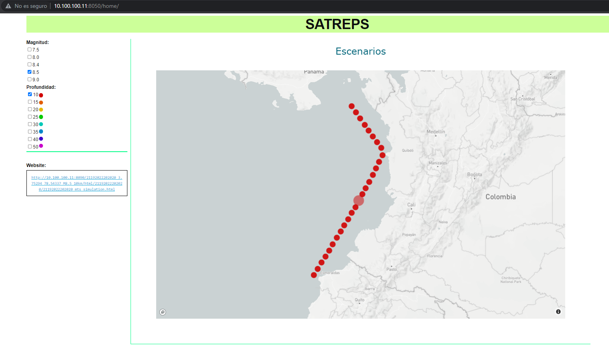

# Visualizador_Satreps
Es una página web creada para visualizar los eventos del proyecto SATREPS. Su desarrollo se hizo en python con los siguientes frameworks: Dash y Flask.
## 1. Instalación 
**(Tenga en cuenta que debe tener la carpeta /mnt/escenarios montada.)**

Python Versión 3.6 en adelante. (Usaremos como ejemplo python 3.7)
```bash
sudo apt-get install python3.7 (o 3.8)
```
Tener virtualenv en python.
```bash
python3.7 -m pip install virtualenv
```

### Usando virtualenv
```bash
conda deactivate #En caso de que haya un ambiente de anaconda activo
virtualenv .stp_venv
source .stp_venv/bin/activate
pip install -r requirements.txt
```

# 2. Demo

## Escenarios:

Vamos a montar los escenarios en la web. Dentro de la carpeta * /mnt/escenarios/web_page *, dígite la siguiente línea:

~~~bash
python3 -m http.server 8090 --bind 10.100.100.11
~~~

donde el servidor es 10.100.100.11 y el puerto es 8090. El escenario se observará en el siguiente link:

Escenario:   http://10.100.100.11:8090

Se debe ver del siguiente modo:


## Visualización:
Para correr la visualización, se necesita ejecutar el código run.py que tiene los siguientes parámetros obligatorios:

~~~bash
+s   ++server                Servidor de visualización
+p   ++port                  Puerto de visualización
+es  ++escenario_server      Servidor de escenario (web_page)  
+ep  ++escenario_port        Puerto del escenario (web_page)  
~~~

Teniendo en cuenta el servidor y el puerto donde se montaron los escenarios, vamos a crear la visualización en el servidor 10.100.100.11 pero en el el puerto 8050.
Para hacerlo, digitemos la siguiente línea:

~~~bash
source .stp_venv/bin/activate
python run.py +s 10.100.100.11 +p 8050 +es 10.100.100.11 +ep 8090
~~~

Luego, en un navegador digite el link de visualización: 

Visualización:   http://10.100.100.11:8050


Al hacer click en **Go to SATREPS** los redirige al /home correspondiente al 
visualizador de eventos del proyecto SATREPS: 

Visualización[home]:   http://10.100.100.11:8050/home

En la parte izquierda se puede escoger la magnitud y profundidad deseada, luego de ello, el 
mapa interactivo se actualiza con los sismos que cumplen los anteriores parámetros. 


En este punto se debe hacer click en el evento que desea observar la simulación. En la parte inferior
izquierda se observa un recuadro titulado como **Website**. En dicho recuadro aparece el enlace que va a redirigir a la página de simulación. 



En la anterior figura se hizo click en un sismo ubicado en lat:2.87969, lon:77.76020 con magnitudde M8.5 y profundidad de 50km. Su respectivo enlace se actualizo en el recuadro y corresponde a la siguiente ruta: /mnt/escenarios/21192022202020_2.87969_77.76020_M8.5_50km/html/21192022202020

Al hacer click en el enlace se observa la siguiente simulación:


**NOTA: No se visualiza la animación mp4 porque se deben actualizar los permisos de ejecución de /mnt/escenarios**

Por último, si se da click en 'source model SWIFT 1' o 'source model SWIFT 2' se pueden ver los modelos generados por swift1 o swift2 respectivamente.


## 4. Autores

- Emmanuel Castillo ecastillo@sgc.gov.co
- Angel agudelo adagudelo@sgc.gov.co

19-07-2021